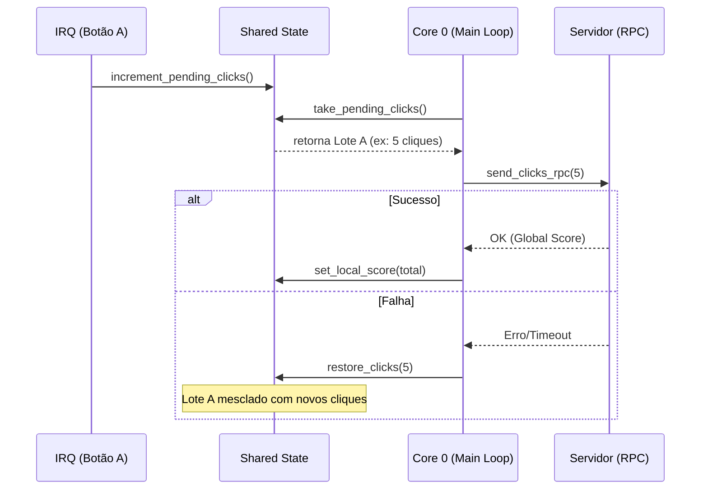

# Coleta e Restauração Atômica de pending_clicks pela Lógica de Jogo (Core 0)

Este documento descreve a implementação da User Story 04, que garante a integridade dos cliques registrados pelo usuário, mesmo em condições de instabilidade na rede.

## Objetivo
Garantir que nenhum clique do botão A seja perdido entre o registro físico (IRQ) e o processamento no servidor (RPC), permitindo que lotes não enviados sejam mesclados com novos cliques.

## Aspectos de Implementação

## Arquitetura e Atores

*   **IRQ (Core 0):** Produtora de cliques. Incrementa `pending_clicks`.
*   **Loop Principal (Core 0):** Consumidor e Restaurador. Usa `take` para consumir um lote e tentar o envio RPC, e `restore` em caso de falha.
*   **Core 1:** Somente Apresentação. Lê o estado para atualizar o display, sem alterar dados da lógica do jogo.

### 1. Registro Sem Perdas (IRQ)
A interrupção de hardware do botão A incrementa o campo `pending_clicks` no Estado Compartilhado.
* **API**: `shared_state_increment_pending_clicks()`
* **Garantia**: O uso de spinlocks protege contra condições de corrida com o Core 0.

### 2. Consumo em Lote (Take)
O Core 0 consome todos os cliques acumulados de uma só vez para tentar o envio.
* **API**: `shared_state_take_pending_clicks()`
* **Semântica**: "Ler e Zerar". O valor é retornado ao chamador e o campo no estado é zerado atomicamente.

### 3. Restauração e Merge (Restore)
Caso a tentativa de envio (JSON-RPC) falhe, o lote consumido deve ser devolvido ao sistema.
* **API**: `shared_state_restore_clicks(n)`
* **Semântica**: "Merge". O valor `n` é somado ao `pending_clicks` atual.
* **Cenário de Corrida**: Se novos cliques ocorrerem durante a tentativa de RPC, o `restore` garante que o lote antigo seja somado aos novos, sem sobrescrevê-los.

## Fluxo de Sucesso vs Falha

## Invariantes
1. `local_score` só aumenta após a confirmação de recebimento pelo servidor.
2. A soma de `local_score + pending_clicks` (em um dado instante) representa o total real de cliques realizados no dispositivo.

## Plano de Testes e Aceite

Para validar que a funcionalidade foi implementada corretamente e atende aos critérios de aceite, execute os seguintes cenários de teste manual observando o log serial e o display OLED.

### Cenário 1: Sucesso Simples (Caminho Feliz)
*   **Objetivo:** Validar o consumo de cliques sem perda ou dupla contagem quando a rede está funcional.
*   **Ação:** Com a placa conectada, pressione o botão A 5 vezes seguidas, com pausas curtas (aprox. 500ms) entre os cliques, fora de um período de falha simulada.
*   **Observação Esperada (Logs):**
    *   Surgirão logs `[RPC_TX] Consumindo batch atômico de 1 cliques...` repetidas vezes.
    *   Seguidos por `[RPC_OK] Placar confirmado atualizado para: X` (crescendo linearmente).
*   **Observação Esperada (Apresentação):**
    *   O `local_score` no display (gerenciado pelo Core 1) crescerá monotonicamente até 5, sem pular números.

### Cenário 2: Falha RPC e Merge de Cliques (Recuperação)
*   **Objetivo:** Validar que nenhum clique é perdido durante uma instabilidade de rede e que o `pending_clicks` acumula monotonicamente.
*   **Ação:** Sabendo que o simulador (`send_clicks_rpc`) falha a cada 3 tentativas, inicie uma sequência rápida de cliques no momento em que uma falha ocorrer (momento do "cooldown" de 1s). Clique cerca de 7 vezes rapidamente.
*   **Observação Esperada (Logs):**
    *   Um erro inicial: `[RPC_FAIL] Restore crítico...` e início do cooldown de 1s.
    *   Durante a "rajada" de cliques no cooldown, os logs mostrarão o crescimento monotônico: `[BTN_MONITOR] pending_clicks cresceu para: 2... 4... 7...`
    *   Quando o cooldown acabar, um único log de envio englobando tudo: `[RPC_TX] Consumindo batch atômico de X cliques. Iniciando envio...` (onde X será o número exato de cliques armazenados durante o cooldown mais o lote restaurado).
*   **Observação Esperada (Apresentação):**
    *   O display congelará o `local_score` durante a falha. Após o término do cooldown e o sucesso do próximo RPC, o placar dará um salto (ex: de 2 para 9), refletindo a consolidação atômica e o recebimento de todos os eventos sem perda de frame. A contagem total física de apertos de botão DEVE bater com o display final.

